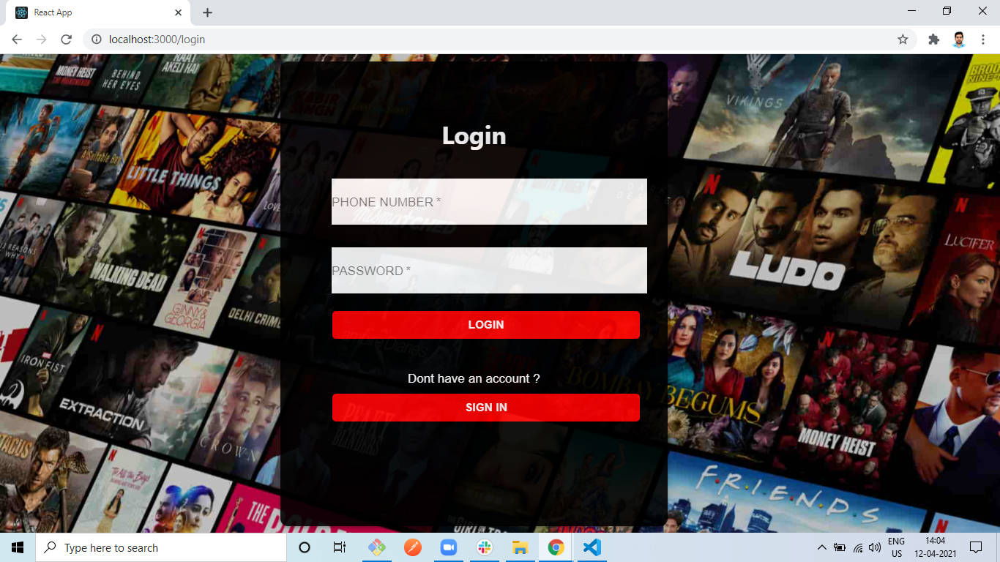
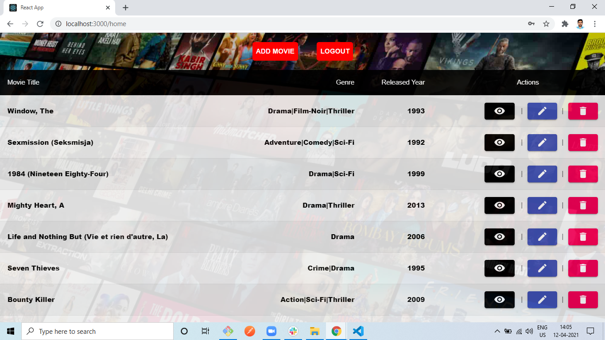

# MoviesDB-CRUD
An application that consists movies database where we can find movies and can perform CRUD opearations on it.

# Screenshots 






# Tech Stacks
* React JS
* Material UI
* React-Redux
    
## Run Project Locally
Clone the App
```
git clone "https://github.com/pranaykumar999/MoviesDB-CRUD.git"

make sure that your server is running actively. If not follow the below steps

git clone "https://github.com/pranaykumar999/MoviesDB-Server.git"

cd MoviesDB-Server

nodemon server.js

Now the server is ready, Lets goto our client folder

cd MoviesDB-CRUD

type `npm start` in command line

Now your app is ready and running on your local machine

```

# Features 
* Signup
  - Register with Phone & Password

* Login
  - Login with Phone & Password

* Home
  - Can view all the movies in a table
  - User can Edit a movie by clicking on Edit Icon
  - User can view particular movie details by clicking on View Icon
  - User can delete particular movie item by clicking on Delete Icon
